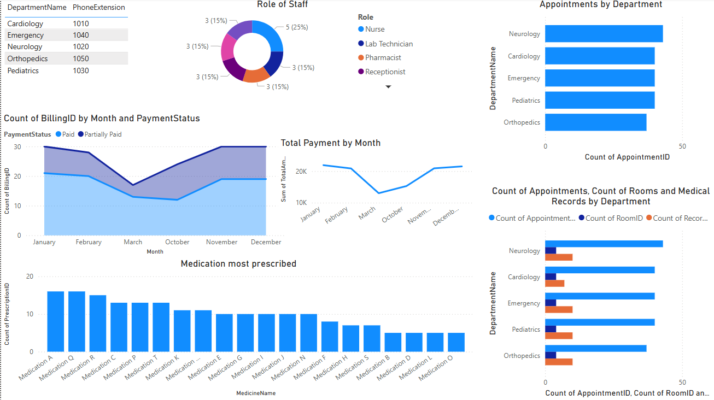
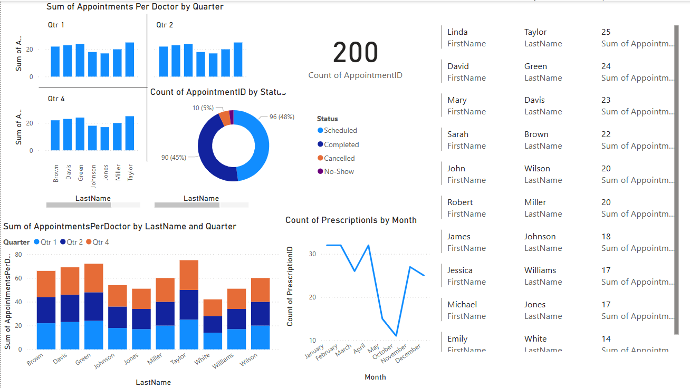
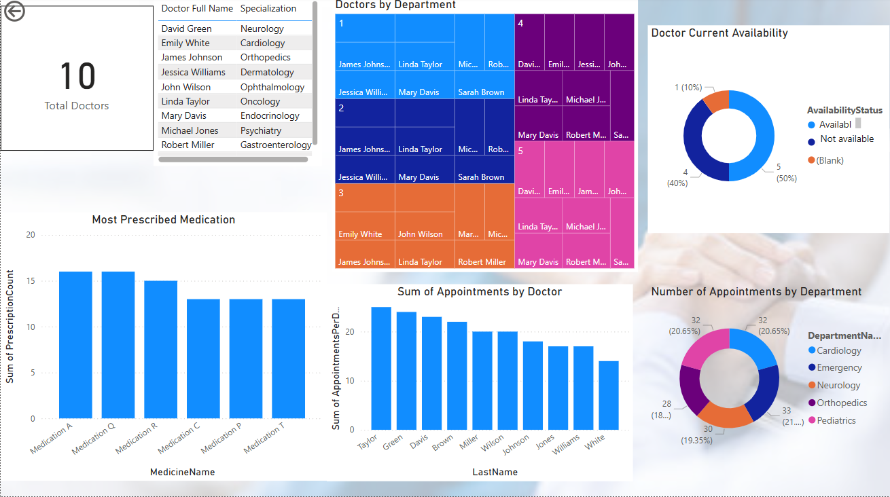
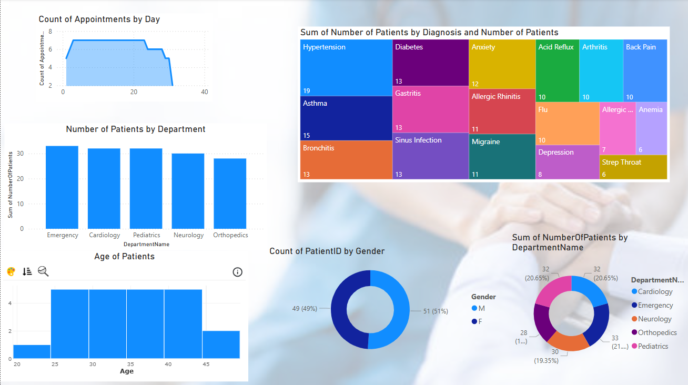
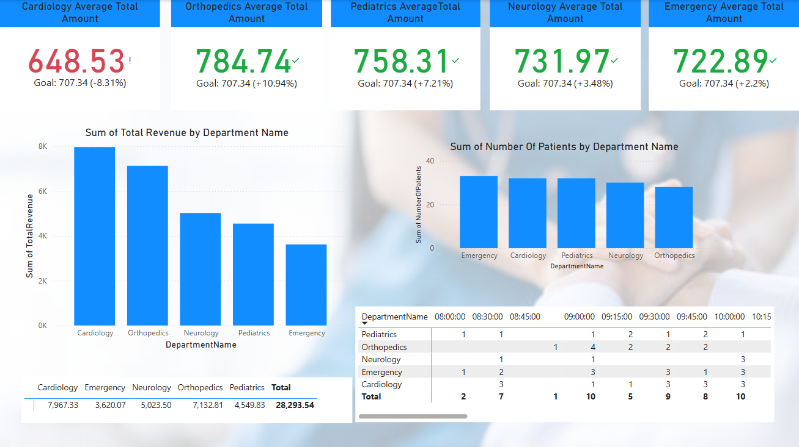

# Hospital Insights Dashboard

## Project Overview

A hospital database management and analytics solution that combines structured data storage with interactive visual dashboards. The project is designed to enable efficient data management and provide actionable insights into hospital operations, patient management, and resource utilization.

## This project includes:

- A SQL database model to manage hospital data.

- Pre-populated database rows for testing and demonstration.

- Power BI dashboards to visualize key performance indicators (KPIs).

## Features

### 1. Database Design:

A normalized database schema for managing hospital operations. The database includes the following key tables:

**Patient:** Stores demographic details of patients.

**Doctor:** Stores the details of doctors, including their specialization and contact details.

**Department:** Defines different hospital departments such as Cardiology, Neurology, etc.

**Appointment:** Manages patient appointments with doctors.

**Medical Records:** Records all patient medical history, including diagnosis and treatment.

**Prescription:** Keeps track of prescribed medicines for each patient's medical record.

**Medicine:** Stores information about available medicines.

**Billing:** Handles billing and payments for hospital services.

**Staff:** Stores information about non-medical staff (nurses, administrative staff, technicians, etc.).

**Room:** Maintains information about hospital rooms and their status.

**Room Assignment:** Records patient room assignments

### 2. Data Visualization:

</br></br></br>

</br></br></br>

</br></br></br>

</br></br></br>

</br></br></br>


## Setup Instructions

### Prerequisites

- **Database Management System**: MySQL, PostgreSQL SQL Server, etc...

- **Power BI Desktop**: For viewing and interacting with dashboards.

### Steps to Recreate the Project

**1. Clone the repository:**

```bash
git clone https://github.com/AhmedOT22/Hospital-Insights-Dashboard.git
```

**2. Set up the database:**

- Open your SQL management tool.

- Execute the model.sql script to create the schema.

- Run the data_inserts.sql script to populate the tables with sample data.

**3. Open the dashboard:**

- Open hospital.pbix in Power BI Desktop.

- Connect the dashboard to your database using the provided configuration settings.

## Contributors:

Ahmed Ouazzani

